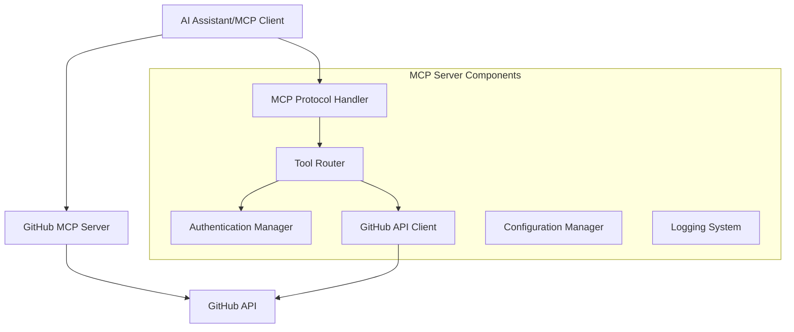

# GitHub MCP Server Design Document

## Overview

The GitHub MCP Server is a Rust-based implementation of the Model Context Protocol (MCP) that provides GitHub integration capabilities for AI assistants. The server exposes GitHub operations as MCP tools, enabling seamless interaction with repositories, issues, pull requests, and other GitHub resources.

The design follows a modular architecture with clear separation between MCP protocol handling, GitHub API integration, and business logic. The server will be built using async Rust with tokio for high-performance concurrent operations.

## Architecture

### High-Level Architecture



### Component Architecture

The server consists of several key components:

1. **MCP Protocol Handler**: Manages the MCP protocol communication, request/response serialization
2. **Tool Router**: Routes MCP tool calls to appropriate GitHub operations
3. **Authentication Manager**: Handles GitHub token validation and management
4. **GitHub API Client**: Abstracts GitHub REST API interactions
5. **Configuration Manager**: Manages server configuration and environment variables
6. **Error Handler**: Provides consistent error handling and user-friendly messages

## Components and Interfaces

### MCP Protocol Handler

**Responsibilities:**
- Handle MCP protocol handshake and initialization
- Parse incoming MCP requests and serialize responses
- Manage MCP session state and capabilities

**Key Interfaces:**
```rust
pub trait McpHandler {
    async fn handle_initialize(&mut self, params: InitializeParams) -> Result<InitializeResult>;
    async fn handle_tool_call(&mut self, request: ToolCallRequest) -> Result<ToolCallResponse>;
    async fn list_tools(&self) -> Result<Vec<Tool>>;
}
```

### GitHub API Client

**Responsibilities:**
- Authenticate with GitHub API using personal access tokens
- Make HTTP requests to GitHub REST API endpoints
- Handle rate limiting and retry logic
- Parse GitHub API responses

**Key Interfaces:**
```rust
pub trait GitHubClient {
    async fn authenticate(&mut self, token: &str) -> Result<User>;
    async fn list_repositories(&self, params: ListReposParams) -> Result<Vec<Repository>>;
    async fn get_file_content(&self, repo: &str, path: &str, ref_: Option<&str>) -> Result<FileContent>;
    async fn list_issues(&self, repo: &str, params: ListIssuesParams) -> Result<Vec<Issue>>;
    async fn create_issue(&self, repo: &str, issue: CreateIssueRequest) -> Result<Issue>;
}
```

### Tool Router

**Responsibilities:**
- Map MCP tool names to GitHub operations
- Validate tool parameters
- Execute GitHub operations and return formatted responses

**Available Tools:**
- `github_auth`: Authenticate with GitHub token
- `github_list_repos`: List user repositories
- `github_search_repos`: Search repositories
- `github_get_file`: Read file contents
- `github_list_directory`: List directory contents
- `github_list_issues`: List repository issues
- `github_create_issue`: Create new issue
- `github_update_issue`: Update existing issue
- `github_list_prs`: List pull requests
- `github_create_pr`: Create pull request

### Authentication Manager

**Responsibilities:**
- Store and validate GitHub authentication tokens
- Manage authentication state across requests
- Handle token refresh if needed

**Key Interfaces:**
```rust
pub trait AuthManager {
    async fn set_token(&mut self, token: String) -> Result<()>;
    fn get_token(&self) -> Option<&str>;
    async fn validate_token(&self) -> Result<bool>;
    fn is_authenticated(&self) -> bool;
}
```

## Data Models

### Core Data Structures

```rust
// Repository representation
#[derive(Debug, Clone, Serialize, Deserialize)]
pub struct Repository {
    pub id: u64,
    pub name: String,
    pub full_name: String,
    pub description: Option<String>,
    pub private: bool,
    pub html_url: String,
    pub clone_url: String,
    pub default_branch: String,
}

// Issue representation
#[derive(Debug, Clone, Serialize, Deserialize)]
pub struct Issue {
    pub id: u64,
    pub number: u32,
    pub title: String,
    pub body: Option<String>,
    pub state: IssueState,
    pub labels: Vec<Label>,
    pub assignee: Option<User>,
    pub html_url: String,
}

// File content representation
#[derive(Debug, Clone, Serialize, Deserialize)]
pub struct FileContent {
    pub name: String,
    pub path: String,
    pub content: Option<String>, // Base64 encoded for binary files
    pub encoding: String,
    pub size: u64,
    pub sha: String,
}

// MCP Tool definition
#[derive(Debug, Clone, Serialize, Deserialize)]
pub struct Tool {
    pub name: String,
    pub description: String,
    pub input_schema: serde_json::Value,
}
```

### Configuration Model

```rust
#[derive(Debug, Clone)]
pub struct ServerConfig {
    pub github_api_url: String,
    pub request_timeout: Duration,
    pub log_level: String,
    pub max_retries: u32,
    pub rate_limit_buffer: u32,
}
```

## Error Handling

### Error Types

The server implements a comprehensive error handling system with specific error types:

```rust
#[derive(Debug, thiserror::Error)]
pub enum GitHubMcpError {
    #[error("Authentication failed: {0}")]
    AuthenticationError(String),
    
    #[error("GitHub API error: {status} - {message}")]
    GitHubApiError { status: u16, message: String },
    
    #[error("Rate limit exceeded. Retry after: {retry_after}")]
    RateLimitError { retry_after: u64 },
    
    #[error("Network error: {0}")]
    NetworkError(String),
    
    #[error("Permission denied: {0}")]
    PermissionError(String),
    
    #[error("Invalid configuration: {0}")]
    ConfigError(String),
    
    #[error("MCP protocol error: {0}")]
    McpError(String),
}
```

### Error Response Format

All errors are returned to the MCP client in a standardized format:

```rust
#[derive(Debug, Serialize)]
pub struct ErrorResponse {
    pub code: i32,
    pub message: String,
    pub data: Option<serde_json::Value>,
}
```

### Retry Logic

The server implements exponential backoff retry logic for:
- Network timeouts
- GitHub API rate limits
- Temporary GitHub API errors (5xx status codes)

## Testing Strategy

### Unit Testing

- **Component Testing**: Test each component in isolation with mocked dependencies
- **GitHub API Client**: Mock HTTP responses to test API interaction logic
- **Tool Router**: Test tool parameter validation and response formatting
- **Authentication Manager**: Test token validation and state management

### Integration Testing

- **End-to-End MCP Flow**: Test complete MCP request/response cycles
- **GitHub API Integration**: Test against GitHub API with test repositories
- **Error Scenarios**: Test error handling with various failure conditions

### Test Structure

```rust
#[cfg(test)]
mod tests {
    use super::*;
    use mockito::Server;
    
    #[tokio::test]
    async fn test_authenticate_success() {
        // Test successful authentication
    }
    
    #[tokio::test]
    async fn test_list_repositories() {
        // Test repository listing
    }
    
    #[tokio::test]
    async fn test_rate_limit_handling() {
        // Test rate limit error handling
    }
}
```

### Performance Testing

- **Concurrent Requests**: Test server performance under concurrent MCP requests
- **Memory Usage**: Monitor memory consumption during long-running operations
- **Rate Limit Compliance**: Ensure proper rate limit handling under load

## Implementation Dependencies

### Core Dependencies

```toml
[dependencies]
tokio = { version = "1.0", features = ["full"] }
serde = { version = "1.0", features = ["derive"] }
serde_json = "1.0"
reqwest = { version = "0.11", features = ["json"] }
thiserror = "1.0"
tracing = "0.1"
tracing-subscriber = "0.3"
clap = { version = "4.0", features = ["derive"] }
base64 = "0.21"
url = "2.0"
```

### Development Dependencies

```toml
[dev-dependencies]
mockito = "1.0"
tokio-test = "0.4"
tempfile = "3.0"
```

## Security Considerations

### Token Management

- GitHub tokens are stored in memory only, never persisted to disk
- Tokens are validated on first use and periodically re-validated
- Support for token rotation without server restart

### API Security

- All GitHub API requests use HTTPS
- Request/response logging excludes sensitive data
- Rate limiting prevents abuse of GitHub API

### Input Validation

- All MCP tool parameters are validated against JSON schemas
- Repository names and paths are sanitized to prevent injection attacks
- File content is properly encoded/decoded to handle binary data

## Deployment and Configuration

### Environment Variables

```bash
GITHUB_API_URL=https://api.github.com  # Default GitHub API URL
REQUEST_TIMEOUT=30                      # Request timeout in seconds
LOG_LEVEL=info                         # Logging level
MAX_RETRIES=3                          # Maximum retry attempts
RATE_LIMIT_BUFFER=10                   # Rate limit buffer percentage
```

### Startup Sequence

1. Load configuration from environment variables
2. Initialize logging system
3. Validate configuration parameters
4. Start MCP server on specified transport (stdio/TCP)
5. Register available tools with MCP client
6. Begin handling MCP requests